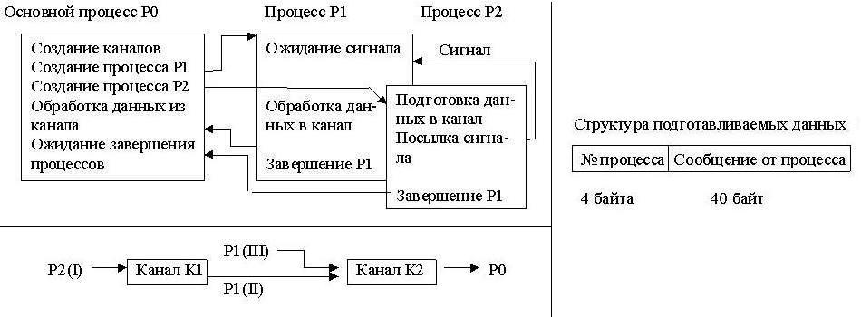

# Лабораторные работы по дисциплине "Управление ресурсами в ОС UNIX" #
## Описание заданий для лабораторных работ ##

**1**. Программные средства для управления системными ресурсами. Файловая система ОС UNIX.
>Реализован вариант: Программа подсчитывает количество и выводит список всех файлов (без каталогов) в алфавитном порядке в поддереве, начиная с каталога, имя которого задано параметром программы.

**2**. Порождение нового процесса и работа с ним. Запуск программы в рамках порожденного процесса.
>Реализован вариант: Разработать программу, вычисляющую значение функции `f(x) = Pi • sinh(x)` в точке `x`. Для нахождения `Pi` и `sinh(x)` программма должна породить два параллельных процесса, вычисляющих эти величины путем разложения в ряд по формулам вычислительной математики.

**3**. Синхронизация процессов.
>Исходный процесс создает два программных канала К1 и К2 и порождает два процесса Р1 и Р2, каждый из которых готовит данные для обработки их основным процессом. Подготавливаемые данные процесс Р2 помещает в канал К1, затем они оттуда читаются процессом Р1, переписываются в канал К2, дополняются своими данными. Схема взаимодействия процессов, порядок передачи данных в канал и структура подготавливаемых данных изображены ниже: 
Обработка данных основным процессом заключается в чтении информации из программного канала К2 и печати её. Кроме того, посредством выдачи сообщений необходимо информировать обо всех этапах работы программы (создание процесса, завершение посылки данных в канал и т.д.).

**5**. Межпроцессное взаимодействие программ.
>Родительский процесс помещает в сегмент разделяемой памяти имена программ из предыдущих лабораторных работ, которые могут быть запущены. Выполняя некоторые циклы работ, порожденные процессы случайным образом выбирают имена программ из таблицы сегмента разделяемой памяти, запускают эти программы, и продолжают свою работу. Посредством аппарата семафоров должно быть обеспечено, чтобы не были одновременно запущены две одинаковые программы. В процессе работы через очередь сообщений родительский процесс информируется, какие программы и от имени кого запущены.